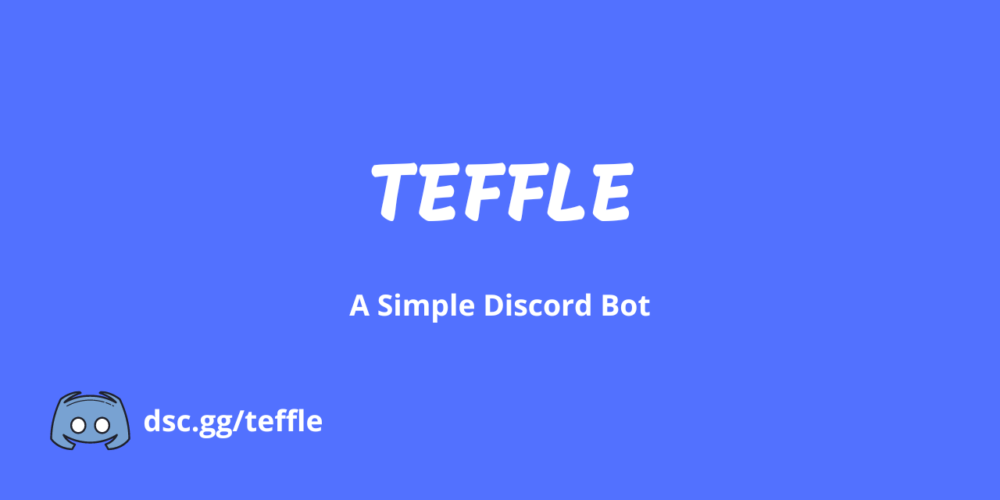

**[Availble in English](en.md)**

# TEFFLE

## DISCORD - BOT

### C'est Quoi Teffle ?

C'est un **bot discord** polyvalent et *open-source* **Français** est disponible en **[anglais](en.md)**, qui gère votre serveur discord avce les ***"/"*** Commande ou Slash Commande.

### Il est capable de quoi ?

**Teffle** est encore en développement, vous pouvez aider en créent un **pull request** sur *GitHub*.

### En quel language est-il fait ?

**Teffle** est programé en **[JavaScript](https://www.google.com/search?q=javascript)**, avec la librairie **[DiscordJs](https:///www.discordjs.guide)**, dont l'**API** en version ***10***
